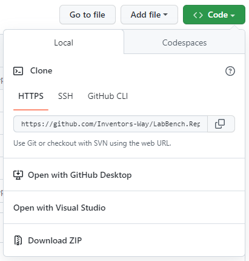
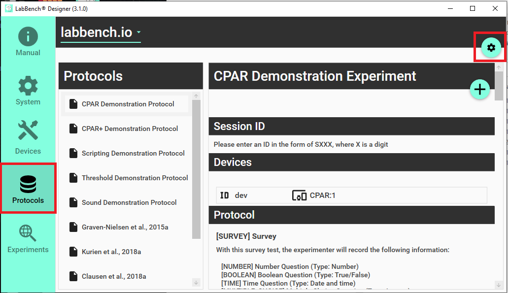
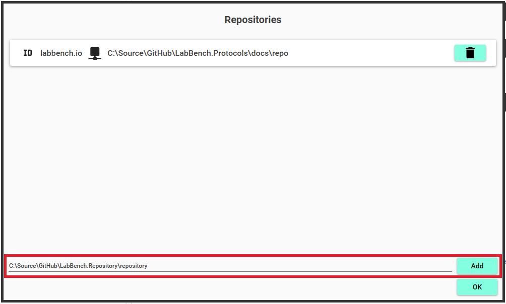

# LabBench.Repository

A LabBench Protocol Repository is a collection of protocols that defines experimental procedures to be performed in experimental studies. A LabBnech Protocol Repository can be used to store, manage, and access a set of protocols that are used by a single research group or which is made publicly available for all scientists. 

LabBench Protocol Repositories can be used to ensure that the protocols used for research studies are well-defined, consistent, and up-to-date.

# How to use this Repository Template

## 1. Download or clone the contents of this template repository

In top right hand corner of the page you are currently reading there is a Code button. Click on this button and choose Download ZIP (this is marked with a red box in the figure below).



This will download all the code in this repository to your computer as a zip file. Once you downloaded the contents of this repository to your computer, unzip the file to a folder of your choice on your computer or network drive.

## 2. Change all repository IDs within the template repository

This template repository has the ID = ```example.labbench.io``` which is found in the ID attributes in the following files:

1. repository.xml which is located in the repository folder.
2. *.expx files in all the protocol subfolders with the repository folder.

Before you can use this repository template as the starting point for your own LabBench Repository you must change these IDs to a unique ID of your own choice.

For example, the Integrative Neuroscience research group at Aalborg University, could use ```integrative-neuroscience.aau.dk```. By using the domain for your organization as part of the ID you garenteee it will be unique as domain names are garanteed to be unique.

## 3. Decide on how to distribute your repository

For LabBench to be able to use a LabBench Protocol Repository it must be able to access the files in the repository. This can be achieved by either storing the repository locally in which case LabBench can access the file throught the windows file system. 

This can either be a folder on the local harddrive or it could be on a network share. 

LabBench can also access the files by downloading them over the internet. This means that if you have a webserver you can upload all the files of the repository to the webserver.

## 4. Add your new repository to your LabBench system

After you created your LabBench Protocol Repository, you must add it to your LabBench system in order to install and use protocols from this repository.

1. Open the LabBench Designer program.
2. Select the Protocols page and click the configure button (the cog-wheel icon):

3. In the resulting dialog, enter the folder path or URL of the location of your repository, and click the ADD button. 

4. Click the OK button.

When the steps above has been completed, you can choose your repository from the drop-down list on the Protocols page and install protocols from your repository.

# Recommended tools for working with LabBench Protocols and Repositories

To set up experiments you will need to write experiment and protocol definition files, which are text files in a very specific format. LabBench is very strict with this format, any errors in one of these files will cause LabBench to reject the file and give an error.

While you can use any text editor to write these files, it will be easier to write these files if you use a text editor that understands the format of these files, so it can assist you in writing them and provide you with feedback immediately if you make an error.

An tool for editing these files would be to install [Visual Studio](https://visualstudio.microsoft.com/vs/ "Code faster. Work smarter. Create the future with the best-in-class IDE."), which can provide code completion (see below) when you write LabBench protocols. Code completion makes it substantially easier to write LabBench protocols.

# What is in a LabBench Protocol Repository

First the most fundamental rule about LabBench Protocol Repositories:

1. What turns a folder into a LabBench Protocol Repository is that this folder MUST contain a ```repository.xml``` file that specifies the protocols within this repository.

This ```repository.xml``` file is what is loaded/downloaded by LabBench in order to provide the list of available protocols on the Protocols page in the LabBench Designer.
